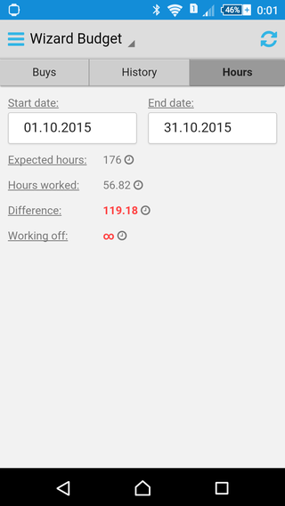

# Wizard Budget

Программа для ведения личного бюджета.

## Возможности

* ведение списка доходов и расходов;
* поддержка указания тегов для каждой записи;
* автоматический расчет текущего баланса;
* автоматический сбор статистики расходов (с группировкой по тегам);
* парсинг SMS от банка (перехват новых и импорт старых);
* планирование покупок (как разовых, так и ежемесячных);
* анализ отработанных часов в Harvest (расчёт размера недоработок с учётом текущего рабочего календаря);
* виджет с текущим балансом и результатом анализа отработанных часов;
* виджет со списком запланированных покупок.

## Особенности

* использование регулярных выражений, задаваемых пользователем, для парсинга SMS от банка;
* поддержка экспорта данных в XML-файл с простой структурой;
* сохранение бекапа данных в Dropbox (в том числе ежедневно автоматически);
* открытый исходный код (репозиторий: https://github.com/thewizardplusplus/wizard-budget).

## Скриншоты

## Лицензия

The MIT License (MIT)

Copyright &copy; 2015, 2023-2024 thewizardplusplus <thewizardplusplus@yandex.ru>
